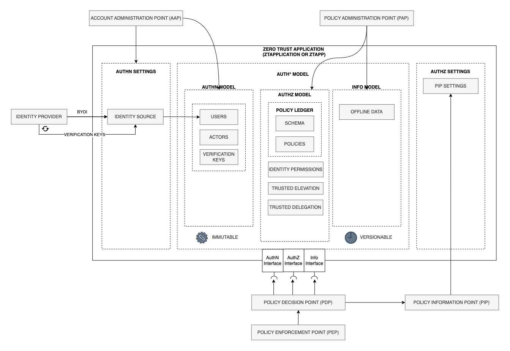
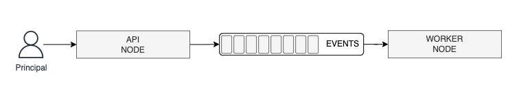
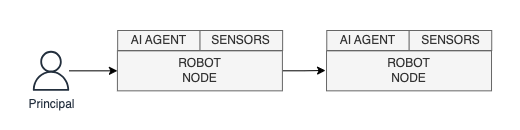
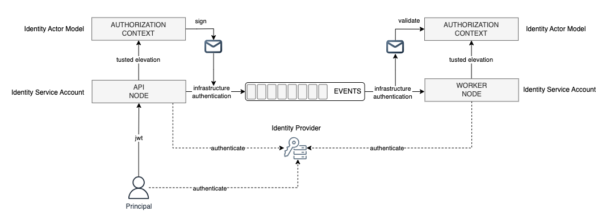
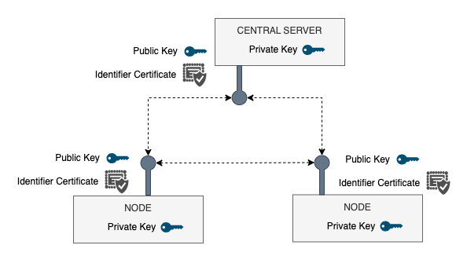

# Identity Actor Model Specification

## 1. Scope and Framework

This specification introduces the `Identity Actor Model`, a core component of the Zero Trust Auth* (`ZTAuth*`) Framework.
It implements the `ZTAuth*` Architecture to provide a secure, scalable, and organized way to manage authorization, aligning with Zero Trust principles.

The `Identity Actor Model`, also known as the `Actor Model` or simply `Actor`, enables secure, permission-based operations through policies.
It links policies directly to specific authorization contexts, ensuring systems operate with only the minimum permissions required for efficiency and security.

### 1.1 Purpose and Scope

The purpose of this specification is to outline how a `Node` can securely act as an `Actor` on behalf of a `Principal`.
It provides clear guidance for both architecture and implementation to enable permissioned operations that fully align with Zero Trust principles, ensuring secure interactions with strictly bounded permissions.

### 1.2 Key Functional Characteristics

The `Identity Actor Model` enhances user, role and group management with:

- **Direct Link Between Identities and `Actor Models`:** Users, roles and groups are mapped directly to `Actor Models`.

- **Customizable `Actor Models`:** Combine `Actor Models` using Union, Intersection, and Difference to support complex permission scenarios.

These features make the `Identity Actor Model` a secure, efficient, scalable, and flexible solution for modern systems.

### 1.3 Underlying Assumptions and Preconditions

`ZTAuth*` assumes that Identity Providers (IdPs) are now the standard and are responsible for managing core identity aspects, such as Users, Roles, and Groups, specifically in the context of Authentication (AuthN) and Identity Management.

`ZTAuth*` primarily focuses on **Zero Trust** security, managing the metadata of identities provided by the IdP and implementing the entire Authorization (AuthZ) layer.

This approach ensures that `ZTAuth*` remains focused and dedicated to authorization within a **Zero Trust** framework, while leveraging the capabilities of Identity Providers to handle authentication and identity management.

### 1.4 Integration with Zero Trust Architecture

The `ZTAuth*` Architecture is outlined below.

For further details, refer to `https://github.com/ztauthstar/ztauthstar-publications`.



### 1.5 Applicable Use Domains

The `Identity Actor Model` is versatile and applies to a wide range of domains, including, but not limited to:

- **Cloud Computing**: Secure and precise access control for cloud resources and services.
- **Microservices**: Enforcing secure interactions while maintaining isolation.
- **API Management**: Providing controlled and auditable API access.
- **IoT and Edge Computing**: Managing secure device-to-cloud and edge interactions.
- **Multi-Tenant Systems**: Ensuring resource segregation and tenant isolation.
- **Distributed Systems**: Securing operations across distributed components.
- **Federated Systems**: Enabling safe collaboration between independent entities.
- **Blockchain/DLT**: Supporting secure `node`, smart contract, and app interactions.
- **Data Privacy**: Handling sensitive data securely and meeting compliance.
- **DevOps/CI/CD**: Automating secure deployments and operations.
- **AI/ML**: Managing secure access to models and datasets.
- **Digital Transformation**: Scaling secure operations in modern IT.
- **Digital Wallets**: Ensuring secure management and transactions for wallets in public and private sectors.

We can summarize as following:

    The `Identity Actor Model` applies to any system—whether hardware, software, or a combination of both—where a `Node` is responsible for managing requests from a `Principal`.
    The `Node` securely processes these requests within a clearly defined authorization context, acting as an `Actor` and performing actions strictly on behalf of the `Principal` while enforcing necessary security and operational boundaries.

Below are two illustrative examples to help understand the concept. These are purely figurative and not exhaustive, meant only to provide practical context:

- An API receives a request from a client and identifies the principal using the provided Authentication Token. Once the principal is identified, the system elevates to a specific `Actor Model` and performs the action on behalf of the principal. This action may involve various operations, such as sending a message to a message broker like Kafka in a signed and certified manner. Subsequently, a Worker `node`, operating with its own authentication token as a service account, retrieves the message from the message broker. The Worker `node` verifies the message, elevates to the target `Actor Model`, and executes the intended action on behalf of the principal, ensuring secure and controlled operations throughout the process.



- An AI-powered robot with sensors acts as a field agent and receives commands directly from a client (principal). The robot identifies the principal using an Authentication Token and elevates to a specific `Actor Model`. The elevated context ensures the robot can perform actions securely on behalf of the principal. The robot processes the input, interacts with its onboard devices (e.g., cameras or actuators), and performs tasks such as collecting data or performing physical actions in the field. If a secondary operation is required, such as delegating tasks to another robot or device, the first robot communicates securely with the second device. This communication uses the same principle of verifying messages, elevating to the required `Actor Model`, and performing actions securely and within the bounds of the assigned authorization.



Important Notes:

- **Authentication Agnosticism**: The principal can be recognized by the system using an `Authentication Token` or any other industry-standard authentication mechanism.
  This approach ensures the system is agnostic to specific authentication implementations, providing flexibility and compatibility across various standards.

- **`Node` Chaining**: `Nodes` can be concatenated without any limit to the number of connections. Each `node` in the chain must independently elevate to the appropriate `Actor Model` and securely perform actions on behalf of the principal.  
   For example, a possible chain could be: `API -> Worker -> API -> API -> Worker -> Robot -> API -> Worker -> API`.

### 1.6 Reference Implementation Scenario

To explain the concepts in this document, consider an **accounting system** with two business roles:

- **John**: An `accountant` who manages all parts of the invoice process (view, create, update, delete, approve, reject).
- **Bob**: An `apprentice` who can only view invoices and cannot perform other actions.

As Bob gains experience, John sometimes assigns him extra tasks. For example, when John is unavailable, Bob is allowed to either **create or update new invoices**, but these invoices must remain pending until approved by another accountant.

This example demonstrates how responsibilities can be shared in a bounded way, with clear limits to ensure accountability and security.



The diagram illustrates the `Identity Actor Model` in action, where an application processes a request using an `API Node` and a `Worker Node`, both acting as `Actors` on behalf of a `Principal`.

1. **API Node**:
   - The `API Node` elevates its authorization context to that of the `Actor` and performs the operation within strict security boundaries.
   - It signs the message and publishes it to the message broker (e.g., Kafka).

2. **Worker Node**:
   - The `Worker Node` retrieves the message from the broker, elevates its authorization context to that of the same `Actor`, and validates the message.
   - It then performs the requested action securely on behalf of the `Principal`.

All requests processed by the `API Node` and `Worker Node` use the same infrastructure authentication. The combination of signing and validation, along with bounded permissions defined by the `Actor` model, ensures the security and integrity of operations.

It is important to note that the `Principal` and both `Nodes` are authenticated via the Identity Provider (IdP). The difference is that the `Principal` in this example is a human user, while the `Nodes` authenticate using machine service accounts. Both the `API Node` and `Worker Node` elevate to the same `Actor`, thereby sharing the same authorization context.

This ensures that the distributed nature of the asynchronous operation remains secure and bounded. At both ends, the operations run within the same authorization context, as if the entire process were handled by a single node.

## 2. The Actor Model and Authorization Context

According to the `ZTAuth*` Architecture, the `Actor Model` is strictly linked to the `Authorization Context`. The `Authorization Context` is derived from the `Authorization Model`, which consists of a structured collection of `Policies`.

### 2.1 Definition of Policies

According to the `ZTAuth*` Architecture, policies should ideally be defined in terms of resources and actions. However, this is not strictly required, as other notations can also be used.
The critical aspect is ensuring that a `Policy Ledger` is utilized to store the policies, guaranteeing a Zero Trust approach with immutable and versionable policies.

Below is an example of a policy defined for the implementation scenario. A sample domain-specific language is used, but policies can be created using any policy language.

| Policy ID | Policy Name     | Policy                    |
|-----------|-----------------|---------------------------|
| 1         | create-invoice  | PERMIT create ON invoice  |
| 2         | update-invoice  | PERMIT update ON invoice  |
| 3         | delete-invoice  | PERMIT delete ON invoice  |
| 4         | view-invoice    | PERMIT view ON invoice    |
| 5         | approve-invoice | PERMIT approve ON invoice |
| 6         | reject-invoice  | PERMIT reject ON invoice  |

### 2.2 Definition of Actor Models

The `Actor Model` represents a specific `Actor` within the system. Below, we define the `Actor Model` for the implementation scenario.

There are two types of `Actors` in this context:

- **Role-Based Actor**  
- **Digital Twin Actor**  

Let’s explore how to create examples of `Actor Models` for both types.

| Actor Model ID | Actor Model Type   | Actor Model Name           |
|----------------|--------------------|----------------------------|
| 1              | role-based-actor   | accountant-viewer-actor    |
| 2              | role-based-actor   | accountant-authoring-actor |
| 3              | role-based-actor   | apprentice-approving-actor |
| 4              | role-based-actor   | apprentice-actor           |
| 5              | digital-twin-actor | john-actor                 |
| 6              | digital-twin-actor | bob-actor                  |

The `accountant-viewer-actor` is a `Role-Based Actor` representing a delegated identity with permissions to view invoices.

```json
{
    "actor_model_id": 1,
    "actor_model_type": "role-based-actor",
    "actor_model_name": "accountant-viewer-actor",
    "actor_identity": "*",
    "assumed_by": ["itself", "trusted"]
}
```

The `accountant-authoring-actor` is a `Role-Based Actor` representing a delegated identity with permissions to create, update, and delete invoices.

```json
{
    "actor_model_id": 2,
    "actor_model_type": "role-based-actor",
    "actor_model_name": "accountant-authoring-actor",
    "actor_identity": "*",
    "assumed_by": ["itself", "trusted"]
}
```

The `accountant-approver-actor` is a `Role-Based Actor` representing a delegated identity with permissions to approve or reject invoices.

```json
{
    "actor_model_id": 3,
    "actor_model_type": "role-based-actor",
    "actor_model_name": "accountant-approver-actor",
    "actor_identity": "*",
    "assumed_by": ["itself", "trusted"]
}
```

The `apprentice-actor` is a `Role-Based Actor` representing a delegated identity with permissions to view invoices.

```json
{
    "actor_model_id": 4,
    "actor_model_type": "role-based-actor",
    "actor_model_name": "apprentice-actor",
    "actor_identity": "*",
    "assumed_by": ["itself", "trusted"]
}
```

The `john-actor` is a `Digital Twin Actor` representing a delegated identity that exactly mirrors John's permissions, allowing him to create, update, delete, approve, and reject invoices.

```json
{
    "actor_model_id": 5,
    "actor_model_type": "digital-twin-actor",
    "actor_model_name": "john-actor",
    "actor_identity": "john",
    "assumed_by": ["itself", "strictly-trusted"]
}
```

The `bob-actor` is a `Digital Twin Actor` representing a delegated identity that exactly mirrors Bob's permissions, allowing him to view invoices only.

```json
{
    "actor_model_id": 6,
    "actor_model_type": "digital-twin-actor",
    "actor_model_name": "bob-actor",
    "actor_identity": "bob",
    "assumed_by": ["itself", "strictly-trusted"]
}
```

Below is the structure of the `Actor Model` JSON, with explanations for each field and possible values:

- **`actor_model_id`**: A unique identifier for the `Actor Model`.

- **`actor_model_type`**: Specifies the type of `Actor Model`. Possible values are `role-based-actor` or `digital-twin-actor`.

- **`actor_model_name`**: A descriptive name for the `Actor Model` (e.g., `accountant-viewer-actor`).

- **`actor_identity`**: The identity associated with the `Actor Model`.
  - For `Role-Based Actors`: Can be a wildcard (`*`), meaning any identity can assume this role if it has the required trust or permissions.
  - For `Digital Twin Actors`: Refers to the specific identity mirrored by the `Actor` (e.g., an exact identity ID).

- **`assumed_by`**: Defines who can assume the `Actor Model`. This will be further discussed in the Trusted Elevation section. Possible values are:
  - **`itself`**: Only the identity associated with the current request (the Principal itself) can assume this `Actor` on behalf of the `Principal`.
  - **`trusted`**: Any entity with general trust can assume the identity.
  - **`strictly-trusted`**: Only entities with specific trust for this identity can assume it.

The `ZTAuth*` framework supports both `Role-Based Actors` and `Digital Twin Actors`. However, best practice recommends prioritizing the use of `Role-Based Actors` because they are more flexible and applicable to a wider range of scenarios.

Adding `Digital Twin Actors` should only be done when strictly necessary, as they create an `Authorization Context` that mirrors the original `Principal`. This can result in granting more permissions than needed, weakening the principle of least privilege.

Using bounded `Authorization Contexts` ensures that only the permissions required for the current task are loaded, enhancing security. For instance, if a system bug attempts to execute an action that is permitted for the `Principal` but not for the specific operation being performed, a `Role-Based Actor` will block the action. Conversely, a `Digital Twin Actor` might allow it to proceed, increasing the risk of unintended actions.

### 2.3 Definition of Authorization Models

The `Authorization Model` maps policies to the corresponding `Actor Models`. Below is the definition of the `Authorization Model` for the implementation scenario.

| Actor Model ID | Actor Model Type   | Actor Model Name           | Policies                                                                                      |
|----------------|--------------------|----------------------------|-----------------------------------------------------------------------------------------------|
| 1              | role-based-actor   | accountant-viewer-actor    | view-invoice                                                                                  |
| 2              | role-based-actor   | accountant-authoring-actor | create-invoice, update-invoice, delete-invoice                                                |
| 3              | role-based-actor   | apprentice-approving-actor | approve-invoice, reject-invoice                                                               |
| 4              | role-based-actor   | apprentice-actor           | view-invoice                                                                                  |
| 5              | digital-twin-actor | john-actor                 | view-invoice, create-invoice, update-invoice, delete-invoice, approve-invoice, reject-invoice |
| 6              | digital-twin-actor | bob-actor                  | view-invoice                                                                                  |

This can be implemented by adding a `policies` field to the `Actor Model`. Below are the updated `Actor Models` reflecting this change.

The `accountant-viewer-actor` `actor`:

```json
{
    "actor_model_id": 1,
    "actor_model_type": "role-based-actor",
    "actor_model_name": "accountant-viewer-actor",
    "actor_identity": "*",
    "assumed_by": ["itself", "trusted"]
    "policies": ["view-invoice"]
}
```

The `accountant-authoring-actor` `actor`:

```json
{
    "actor_model_id": 2,
    "actor_model_type": "role-based-actor",
    "actor_model_name": "accountant-authoring-actor",
    "actor_identity": "*",
    "assumed_by": ["itself", "trusted"],
    "policies": ["create-invoice", "update-invoice", "delete-invoice"]
}
```

The `accountant-approver-actor` `actor`:

```json
{
    "actor_model_id": 3,
    "actor_model_type": "role-based-actor",
    "actor_model_name": "accountant-approver-actor",
    "actor_identity": "*",
    "assumed_by": ["itself", "trusted"],
    "policies": ["approve-invoice", "reject-invoice"]
}
```

The `apprentice-actor` `actor`:

```json
{
    "actor_model_id": 4,
    "actor_model_type": "role-based-actor",
    "actor_model_name": "apprentice-actor",
    "actor_identity": "*",
    "assumed_by": ["itself", "trusted"],
    "policies": ["view-invoice"]
}
```

The `john-actor` `actor`:

```json
{
    "actor_model_id": 5,
    "actor_model_type": "digital-twin-actor",
    "actor_model_name": "john-actor",
    "actor_identity": "john",
    "assumed_by": ["itself", "strictly-trusted"],
    "policies": ["view-invoice", "create-invoice", "update-invoice", "delete-invoice", "approve-invoice", "reject-invoice"]
}
```

The `bob-actor` `actor`:

```json
{
    "actor_model_id": 6,
    "actor_model_type": "digital-twin-actor",
    "actor_model_name": "bob-actor",
    "actor_identity": "bob",
    "assumed_by": ["itself", "strictly-trusted"],
    "policies": ["view-invoice"]
}
```

### 2.4 Elevating to the Actor Model

Elevating to an `Actor Model` enables a `Node` to act on behalf of the `Principal` within a secure, bounded `Authorization Context`. This process ensures that all operations are performed according to the policies associated with the `Actor Model`.

Steps to Elevate to the `Actor Model`:

1. **Checking Assignment**:
   The first step is to verify if the `Principal` is assigned to the `Actor Model`. This includes validating that the `Principal` meets the criteria defined in the `assumed_by` field of the `Actor Model`. The criteria for `assumed_by` are detailed in the Trusted Elevation section, and only entities satisfying these conditions can proceed with the elevation.

2. **Loading Policies**:
   Once the assignment is confirmed, the `Node` loads the policies associated with the `Actor Model`. These policies define the specific actions that can be performed under the `Actor Model`.

3. **Creating the Authorization Context**:
   Using the loaded policies, the `Node` constructs an `Authorization Context` tailored to the current `Principal`. This context ensures that operations are scoped to the permissions defined in the `Actor Model`.

4. **Authorization Check**:
   The final step is to verify whether the `Principal` is authorized to execute the requested action within the `Authorization Context`. This ensures strict compliance with the defined policies.

Below is an example of how the code might look in a FastAPI application:

```python
@app.get("/check-permission")
async def has_permission(
    actor: str,
    domain: str,
    resource: str,
    action: str,
    token: str = Depends(oauth2_scheme),
):
    """
    Endpoint to check if the actor has permission for a specific action.
    
    :param actor: Actor identifier
    :param domain: Domain name
    :param resource: Resource name
    :param action: Action to check
    :param token: JWT token for authentication
    """
    if not ztauth.check_permissions(token, actor, domain, resource, action):
        raise HTTPException(
            status_code=403, detail="Permission denied for the requested action."
        )
    return {"message": "Permission granted."}
```

In the sample above, there is no `Node Token` explicitly shown, as it is implicitly used in the background to synchronize the `Auth*` models locally, in alignment with the `ZTAuth*` Architecture.
It is the responsibility of the `ZTAuth*` framework implementation to handle `Node Token` authentication and the synchronization of `Auth*` models.

Differences Between Role-Based and Digital Twin Actors:

- **Role-Based Actor**:
  A `Role-Based Actor` represents a predefined role with a limited, task-specific set of permissions. It adheres to the principle of least privilege by loading only the permissions required for the task at hand.
  - **Example**: An `accountant-viewer-actor` allows viewing invoices but does not grant permissions to modify or approve them.

- **Digital Twin Actor**:
  A `Digital Twin Actor` replicates all permissions of the specific `Principal`. While this can be necessary for scenarios requiring full mirroring of the `Principal`, it may lead to excessive permissions being granted, potentially violating the principle of least privilege.
  - **Example**: A `john-actor` mirrors John’s identity, granting him permissions to view, create, update, delete, approve, and reject invoices.

Key considerations:

- **Security**:
  Elevating to a `Role-Based Actor` minimizes security risks by restricting permissions to those required for the specific task. Elevating to a `Digital Twin Actor`, on the other hand, may expose the system to greater risks by unnecessarily loading excessive permissions.

- **Best Practices**:
Use `Role-Based Actors` whenever possible to enforce minimal privilege. Reserve `Digital Twin Actors` for scenarios where full mirroring of the `Principal` is explicitly required.

By following these steps and adhering to these guidelines, the elevation process ensures secure, task-specific operations within clearly defined boundaries, aligning with the Zero Trust principles of the `ZTAuth*` framework.

## 3. Pairing of the Central Server and Nodes

The `Identity Actor Model` requires a secure and reliable mechanism for `Nodes` to pair with the `Central Server`.
This process is essential not only for the `Central Server` to manage the `nodes` but also to ensure secure communication between the `Central Server` and the `nodes`, as well as among the `nodes` themselves.

### 3.1 The Central Server and Nodes

The `Central Server` serves as the core component that manages all `ZTApplications` within the `ZTAuth*` Architecture. Typically, a `Node` is linked to a single `ZTApplication`.
However, there are no strict limitations, and a `Node` can be linked with multiple `ZTApplications` if necessary.

`Nodes` include both the `Applicative Node` and the proximity-based components, often referred to as `Proximity Nodes` or `PDP Nodes` in the `ZTAuth*` Architecture, designed to handle authorization requests locally with minimal latency.

It is crucial to establish a robust federation mechanism that securely identifies and interconnects the `Central Server`, all `Nodes`, and their associated `ZTApplications`.
This ensures secure communication across the system while adhering to Zero Trust principles, guaranteeing compliance and integrity at every level.

### 3.2 Requirements for Secure Pairing

The `Central Server` and each `Node` must generate a pair of cryptographic keys (public and private) to be used specifically for `Pairing` and `Communication` operations. These keys are not only required for initiating communication with the `Central Server` but also for secure interactions between `Nodes`, as described earlier.

These keys are essential for secure communication and authentication within the system:

- The **public key** will be used for encryption.
- The **private key** will be used for decryption and signing operations, ensuring the integrity and confidentiality of the messages exchanged between the `Central Server` and the `Nodes`, as well as between the `Nodes` themselves.



Both the `Central Server` and each `Node` must provide APIs or other mechanisms (e.g., secure endpoints or dedicated protocols) to allow trusted parties to retrieve their **public keys** and **identification certificates**. These mechanisms are critical for establishing a robust trust network, enabling secure and verifiable communication between all components in the system, and adhering to the Zero Trust principles.

### 3.3 Node Registration Process

The `Node` registration process establishes a secure pairing with the `Central Server` before the `Node` becomes operational or accessible. This process is initiated by a trusted operator and includes the following steps:

1. **Request Registration**:  
   A trusted operator requests the `Central Server` to register a new `Node` by providing necessary details such as the `Node` name and the **public key**. This step must occur in a secure environment (e.g., administration console, secure API endpoint) to protect sensitive information during transmission.
   
2. **Generate Unique Identifier**:  
   The `Central Server` assigns a unique identifier to the `Node` and associates it with the provided details.

3. **Node Confirmation**:  
   The `Node` contacts the `Central Server` to confirm its registration and retrieve the unique identifier certificate and API key. The `Node` signs this request with its private key to ensure authenticity and prevent tampering.

4. **Verification**:  
   The `Central Server` verifies the signature of the request to ensure it originates from the `Node` holding the private key.

5. **Secure API Key Storage**:  
   Before responding, the `Central Server` securely stores the API key to prevent unauthorized access.

6. **Send Credentials**:  
   The `Central Server` sends the unique identifier certificate and API key to the `Node`. This response is encrypted using the `Node`'s public key to ensure confidentiality and data integrity during transmission.

### 3.4 Node Advertisement Protocol

The `Node` advertisement process allows a `Node` to be recognized and verified by the `Central Server` after it becomes operational or accessible. This process is initiated by the `Node` and includes the following steps:

1. **Advertise Presence**:  
   The `Node` advertises itself to the `Central Server` by providing necessary details, such as the `Node` name and the **public key**. This step must occur in a secure environment (e.g., secure API endpoint) to protect sensitive information during transmission.

2. **Receive and Assign Identifier**:  
   The `Central Server` receives the advertisement request and assigns a unique identifier to the `Node`, associating it with the provided details.

3. **Verification**:  
   The `Central Server` performs a verification step (manual or automatic) to validate the authenticity and legitimacy of the `Node`. This step may include using a third-party provider to ensure the `Node` can be trusted.

4. **Secure API Key Storage**:  
   Upon successful verification, the `Central Server` securely stores the API key to prevent unauthorized access.

5. **Send Credentials**:  
   The `Central Server` sends the unique identifier certificate and API key to the `Node`. This response is encrypted using the `Node`'s public key, ensuring confidentiality and data integrity during transmission.

### 3.5 Technical and Security Considerations

Implementing the `Node Registration` and `Node Advertisement` processes, several technical and security considerations must be addressed to ensure the robustness and reliability of the system:

- **Encryption**: All sensitive data, such as the API key and unique identifier, must be encrypted during transmission using the `Node's` public key to prevent eavesdropping.
- **Authentication**: The use of cryptographic keys ensures that only legitimate `Nodes` can pair with the `Central Server`.
- **Revocation Handling**: Both processes must allow for revocation of credentials in case of a security breach, ensuring compromised `Nodes` are immediately excluded from the system.
- **Third-Party Verification**: Incorporating third-party validation strengthens the trustworthiness of the system, particularly for untrusted `Nodes`.

### 3.6 Identifier Certificate Specification

The `Identifier Certificate` is a unique certificate generated by the `Central Server` for each `Node`. This certificate contains important details about the `Node` and its relationship with the `Central Server`. Each field in the certificate has a specific purpose, explained below:

- **certificate_version**: The version of the certificate format (e.g., "1.0"), used to ensure compatibility across the system.
- **certificate_type**: The type of the certificate (e.g., "node_identifier"), indicating its purpose within the system.
- **certificate_id**: A unique identifier for the certificate, used to distinguish it from others in the system.
- **certificate_creation_timestamp**: The date and time when the certificate was created, providing traceability and helping track its lifecycle.
- **certificate_expiration_timestamp**: The date and time when the certificate becomes invalid, ensuring that certificates are periodically refreshed for security.
- **certificate_signature**: A digital signature generated by the `Central Server`, verifying the authenticity and integrity of the certificate.
- **certificate_issuer_id**: The unique identifier of the `Central Server` that issued the certificate, ensuring clear attribution.
- **certificate_issuer_type**: Specifies the type of entity that issued the certificate (e.g., "central_server"), providing context for trust relationships.
- **node_identifier**: A unique ID assigned to the `Node` by the `Central Server`, used for identifying the `Node` within the system.
- **node_name**: The name of the `Node`, provided during its registration or advertisement process, making it easier to reference.
- **node_public_key**: The public key of the `Node`, used for encryption and verification of communications.

> The `Central Server` functions as the Certificate Authority (CA) in this architecture, ensuring trust across the system by signing each certificate.

Here is an example of the `Identifier Certificate` structure:

```json
{
    "certificate_version": "1.0",
    "certificate_type": "node_identifier",
    "certificate_id": "03933209-d244-490c-83df-ffad43f20c67",
    "certificate_creation_timestamp": "2024-01-01T00:00:00Z",
    "certificate_expiration_timestamp": "2024-01-01T00:00:00Z",
    "certificate_signature": "certificate_signature",
    "certificate_issuer_id": "e341f50e-b3a5-45a2-9253-aa6f30a58bbe",
    "certificate_issuer_type": "central_server",
    "node_identifier": "0bc91b6c-fa45-4f22-bc18-a148157f6e75",
    "node_name": "Node1",
    "node_public_key": "node_public_key"
}
```

> **NOTE**: The `Identifier Certificate` structure is provided as an example and can be customized based on the specific requirements of the system, likewise node_public_key and certificate_signature are placeholders for the actual public key and signature.

### 3.7 Procedure for Revocation of Pairing

To maintain security, the `Central Server` must have a solid mechanism for revoking the pairing of `Nodes` in the event of a security breach or a change in the `Node's` status. This ensures untrusted `Nodes` cannot interact with the system.

Revocation Scenarios:

1. **Revocation of a Node**:
   - If a specific `Node` is compromised, the `Central Server` can revoke its pairing.
   - The **API Key**, used only for communication with the `Central Server`, should be deleted. This action immediately blocks the `Node` from interacting with the `Central Server`.
   - The `Identifier Certificate` of the `Node` must be marked as revoked in the system. The revoked status should be logged in a **revoked nodes list**.  
   - Other `Nodes` must check this list to avoid communication with the compromised `Node`.

2. **Revocation of All Nodes** (in case of a Central Server compromise):
   - If the `Central Server` is compromised, all `Nodes` must be treated as untrusted until the pairing is re-established.
   - A new set of cryptographic keys (public and private) must be generated for the `Central Server`.
   - All `API Keys` and `Identifier Certificates` issued by the compromised server must be invalidated.
   - The `Central Server` must issue fresh `API Keys` and `Identifier Certificates` to each `Node` after verifying their authenticity.

Best Practices for Revocation:

- **Real-Time Updates**: The `Central Server` should maintain and distribute an updated **revoked nodes list** to all `Nodes` in real-time to ensure seamless trust verification.
- **Node Verification**: Each `Node` must periodically check the **revoked nodes list** before establishing trust with other `Nodes` or the `Central Server`.
- **Zero Trust Compliance**: The system should adhere to Zero Trust principles, ensuring that no component is implicitly trusted, even after revocation procedures.

This approach ensures a robust and secure revocation process, whether targeting individual `Nodes` or addressing a system-wide compromise.

## 4 Trusted Elevation and Trusted Delegation

The `Trusted Elevation` process is a critical component of the `Identity Actor Model`. It ensures that a `Node` can securely elevate its privileges to a specific `Identity Actor` and act on behalf of a `Principal` within the defined security boundaries of an `Authorization Context`.

### 4.1 Elevation Requirements

The `Node` must be authenticated with its `Service Account` to the Identity Provider (IdP).

### 4.2 Synchronization of Trusted Elevation

The `Node` must synchronize its `Trusted Elevation` list by sending the Authentication Token and the **API Key** to the `Central Server`.

The `Central Server` will verify the `Service Account` and the `Node`, then send back the list of valid `Trusted Elevations`.

The list contains `Identity Actors` to which the `Node` is authorized to elevate. Each `Trusted Elevation` entry is signed by the `Central Server` to ensure the authenticity and integrity of the list.

Here is an example of the `Trusted Elevation List` structure:

```json
{
  "certificate_version": "1.0",
  "certificate_type": "trusted_elevation_list",
  "certificate_id": "03933209-d244-490c-83df-ffad43f20c67",
  "node_identifier": "0bc91b6c-fa45-4f22-bc18-a148157f6e75",
  "node_name": "Node1",
  "trusted_elevations": [
    {
      "identity_actor": "accountant-authoring-actor",
      "valid_from": "2024-01-01T00:00:00Z",
      "valid_until": "2025-01-01T00:00:00Z",
      "signature": "server_signature_for_admin_actor"
    },
    {
      "identity_actor": "accountant-viewer-actor",
      "valid_from": "2024-01-01T00:00:00Z",
      "valid_until": "2025-01-01T00:00:00Z",
      "signature": "server_signature_for_monitor_actor"
    }
  ],
  "creation_timestamp": "2024-01-01T00:00:00Z",
  "expiration_timestamp": "2025-01-01T00:00:00Z",
  "signature": "list_signature"
}
```

> **NOTE**: The `Trusted Elevation List` structure is provided as an example and can be customized based on the specific requirements of the system. Additionally, `list_signature` and `server_signature_for_admin_actor` are placeholders for the actual public key and signature.

### 4.3 Trusted Elevation Process

The `Client`, before sending the principal, can optionally ask the `Node` if it is able to elevate to a specific `Identity Actor`. The `Client` receives the certificate and validates it.

Once the `Client` sends the request to the `Node`, it will load the `Authorization Context` from the `Authorization Model` and elevate to the specified `Identity Actor` in the request.

The `Authorization Model` contains all the policies and data needed by the `Node` to perform the operation and build the `Authorization Context`.

## 5 Trusted Operation Chaining

This section covers the process of securely chaining multiple `nodes`, ensuring that each `node` elevates to the appropriate `Identity Actor` and performs actions on behalf of the principal.
This process ensures the safe chaining of multiple `nodes`, even in the absence of communication with the `Central Server`.

In practice, this works by forwarding requests from one `node` to another. Each `node` presents its certificate as proof that it received a request from a client. The certificate is signed with the private key of the `node`, and this signature can be verified by the next `node` in the chain, ensuring the authenticity and integrity of the request.

## 6 Trusted Federation

Trusted Federation refers to the secure integration of multiple `nodes` across federated environments, ensuring that each `node` operates within the security boundaries of its `Identity Actor` and maintains secure communication with the relevant `Central Servers`.

Federated environments consist of multiple `Central Servers` that may belong to the same organization/application or different organizations/applications.

In the context of operation chaining, the multiple `Central Servers` exchange their public keys and verify the authenticity of the `nodes` that are part of the operation chain request. This ensures that each `node` in the chain is trusted and authorized to perform the requested operations.

## Appendix A. Terminology

### A.1 Glossary of Terms

Here is the list of terms used in this document:

- **`Identity`**: A unique representation of a user, service account, or any other entity recognized by the system. An `Identity` is the foundational concept that defines who or what is interacting with the system, often provided or verified by an Identity Provider (IdP).
- **`Principal`**: A specific `Identity` actively engaged in an authenticated session or action within the system. A `Principal` represents the operational context of an `Identity` during its interaction with the system, including its roles, permissions, and any assumed responsibilities.
- **`Node`**: A hardware or software component in the system architecture. It receives requests from a principal and performs actions within an authorization context on behalf of that principal.
- **`API Key`**: The **API Key** consists of a unique **ID** and a **secret**; the **secret** is hashed before being stored to enhance security, ensuring that sensitive data is protected even if the database is compromised.
- **`Central Server`**: A `Central Server` is a server that implements the Zero Trust Application (`ZTApplication`) as defined by the `ZTAuth*` Architecture.
- **`Actor`**: A type of `delegated identity` that a principal can temporarily assume.
- **`Role-Based Actor`**: An actor-based representation of a predefined role with specific permissions for a particular task or function.
- **`Digital Twin Actor`**: An actor-based representation of an identity that operates independently. It mirrors the behavior and responsibilities of its associated identity, enabling autonomous operations such as scheduled tasks or API interactions.
- **`Zero Trust Elevation (ZT Elevation)`**: The process of dynamically establishing a secure, isolated authorization context for a specific principal. This process leverages the authorization model of the target actor to create a temporary sandbox. The sandbox enforces strict security boundaries, allowing the principal to execute only a predefined set of actions required for a specific task or operation. This ensures adherence to the principle of least privilege, minimizing risk and providing full auditability during execution.
- **`Zero Trust Delegation (ZT Delegation)`**: The resulting secure and temporary authorization context created through the elevation process. This delegated context is tied to a specific principal and derived from the target actor's authorization model. The actor represents the isolated and controlled set of permissions necessary for the operation, ensuring the principal operates within clearly defined, auditable, and temporary boundaries.

## Appendix B. Definitions

### B.1. Definition of the Actor Model

An `Actor` is a type of `delegated identity` that can be `temporarily assumed` by a `Principal` (e.g., a user or an entity represented by an Identity Provider - IdP). `Actors` are designed to `encapsulate specific` and `isolated contexts`, allowing `limited` and `purpose-driven permissions` for particular tasks. They can be configured for the following scenarios:

- **Role-Based Actor**: represents a predefined role with specific permissions for a given task or function, such as `Approvals Manager` or `Compliance Reviewer.`

    >Example: A Principal with the `Finance Specialist` role temporarily elevates their permissions to `Approvals Manager` to approve budget requests without gaining broader permissions.

- **Digital Twin Actor**: a virtual representation of a Principal or Service Account that operates independently. A Digital Twin can assume its own delegated identity to perform specific tasks, such as scheduled processes or API operations, reflecting the capabilities of the original Principal.
    > Example: An application uses a Digital Twin configured by the IdP to represent an `Agent` performing periodic compliance checks across multiple tenants.

Key Features and Benefits of the Actor Model:

- **Zero Trust Security**: Temporary elevation to an Actor enables the Principal to operate with the least privileged set of permissions necessary to complete a specific task. This approach minimizes risks, prevents unauthorized privilege escalation, and ensures full auditability of operations.
    > Example: A user elevates to the `Compliance Reviewer` role to access sensitive reports. Once the task is completed, the elevated permissions are automatically revoked.

- **Role Isolation**: Each Actor is strictly confined to its assigned role or context. This isolation guarantees a clear separation of responsibilities and limits access to resources outside the scope of the active role.
    > Example: A Developer Actor cannot access production operations, while a `Production Deployer` Actor is restricted to deployments only.

- **Future Federation**: The Actor model lays the groundwork for integrating permissions and identities across federated environments. Well-defined roles and permissions allow secure collaboration between systems managed by different IdPs while maintaining security boundaries
    > Example: An organization shares a Digital Twin Actor with a partner to access a subset of sensitive data without exposing the full identity of the original Principal.

Advantages for Distributed and Multi-Organization Systems:

- **Security**: Reduces the attack surface through least privilege and controlled elevation.
- **Flexibility**: Supports dynamic roles, digital twins, and integrations with Identity Providers.
- **Scalability**: Suitable for complex and multi-tenant systems, with centralized management of granular permissions.

## Appendix C. Document History

### C.1 Revision History

- 01 - Initial version

## Appendix D. Specification Notice

### D.1 Guidelines for Referencing

Whenever terms or concepts related to `ZTAuth*` are referenced in this document but not explicitly defined within the current specification, please consult the latest publications and state-of-the-art specifications on `ZTAuth*`.

Additionally, this document uses domain-specific languages (DSL) and JSON as representative examples. These are only illustrative and should not be considered prescriptive.
A real-world implementation may include additional fields or differ in structure, depending on the specific context and implementation requirements. These examples are solely provided to describe and clarify the functionality.

## Appendix E. License and Legal Notice

### E.1 Licensing Terms and Conditions

This project is licensed under the [Creative Commons Attribution-ShareAlike 4.0 International (CC BY-SA 4.0)](https://creativecommons.org/licenses/by-sa/4.0/).

> The work is attributed to Nitro Agility Srl as the sole author and responsible entity, except for referenced content, patterns, or other widely recognized knowledge attributed to their respective authors or sources.
> All content, concepts, and implementation were conceived, designed, and executed by Nitro Agility Srl.
> Any disputes or claims regarding this project should be addressed exclusively to Nitro Agility Srl.
> Nitro Agility Srl assumes no responsibility for any errors or omissions in referenced content, which remain the responsibility of their respective authors or sources.

[](https://creativecommons.org/licenses/by-sa/4.0/)

> The trademark `ZTAuth*` and its associated logo(s), as contained in this repository, are the exclusive intellectual property of Nitro Agility Srl.
> All rights reserved. Unauthorized use, reproduction, or distribution of the `ZTAuth*` trademark and its associated logo(s) is strictly prohibited.
> For inquiries regarding the use of the `ZTAuth*` trademark and its associated logo(s), please contact Nitro Agility S.r.l. at <opensource@nitroagility.com>.
> Copyright © 2024 Nitro Agility S.r.l. All Rights Reserved.

## Appendix F. Authors

### F.1 List of Authors and Contributors

Authored by:

- Nicola Gallo, acting solely as the primary creator and ideator on behalf of Nitro Agility Srl.

> All contributors to this document, including its current and future authors, act strictly as representatives of Nitro Agility Srl.
> Nitro Agility Srl retains full ownership, responsibility, and liability for the content, actions, and implications arising from this work.
> Under no circumstances shall listed authors or any other contributors, past, present, or future, be held personally liable for any disputes, claims, or liabilities related to this document or its usage.
> All such matters shall be addressed exclusively to Nitro Agility Srl.
